# **Traffic Sign Recognition**

**Build a Traffic Sign Recognition Project. Deep Learning and Convolutional Neural Networks**

The goals / steps of this project are the following:
* Load the data set, explore, summarize and visualize the data set
* Design, train and test a model architecture
* Use the model to make predictions on new images
* Analyze the softmax probabilities of the new images
* Summarize the results with a written report


## Writeup 

Here is a link to the [project code](https://github.com/feklistoff/udacity-carnd-project2/blob/master/Traffic_Sign_Classifier.ipynb)


## Data Set Summary & Exploration


### 1. Basic summary of the data set.

* The size of training set is `34799`
* The size of the validation set is `4410`
* The size of test set is `12630`
* The shape of a traffic sign image is `(32, 32, 3)`
* The number of unique classes/labels in the data set is `43`


### 2. Exploratory visualization of the data set.

Here are 10 random images from the training data set:


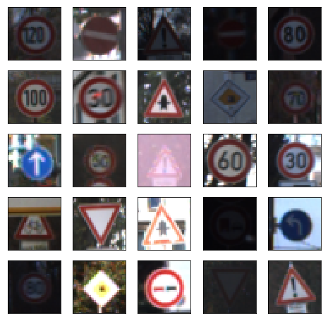


As we can see the data set contains a lot of dark and bright images and needs to be preprocessed before the network's training phase.


Next, let's plot training data distribution across labels:


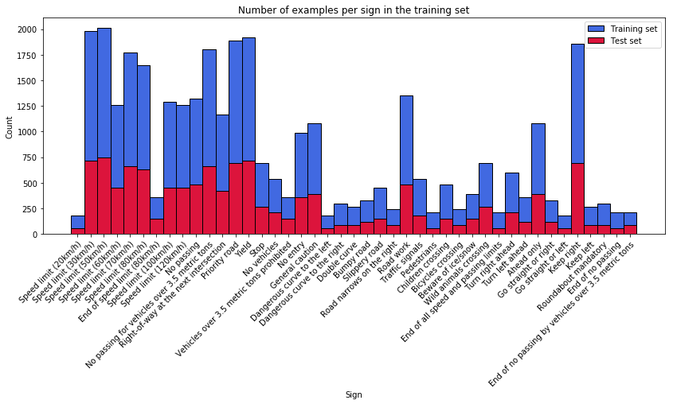


We can see that data is not uniformly distributed. In order to show that in numbers, let's display five min and five max elements:

*Five min elements:*

|  Counts |                  Labels                  |  
|:-------:|------------------------------------------|  
|   180   |         Speed limit (20km/h)             |  
|   180   |         Go straight or left              |  
|   180   |     Dangerous curve to the left          |  
|   210   |  End of all speed and passing limits     |  
|   210   |             Pedestrians                  |  

*Five max elements:*

|  Counts  |                Labels                   |
|:--------:|-----------------------------------------|
|   2010   |        Speed limit (50km/h)             |
|   1980   |        Speed limit (30km/h)             |
|   1920   |                Yield                    |
|   1890   |            Priority road                |
|   1860   |              Keep right                 |


This will certainly impact our model ([more on this here](http://www.chioka.in/class-imbalance-problem/)). However, we won't augment our data and see how the network will manage.

Ok, now let's plot data distribution across all data sets (training, validation and test):


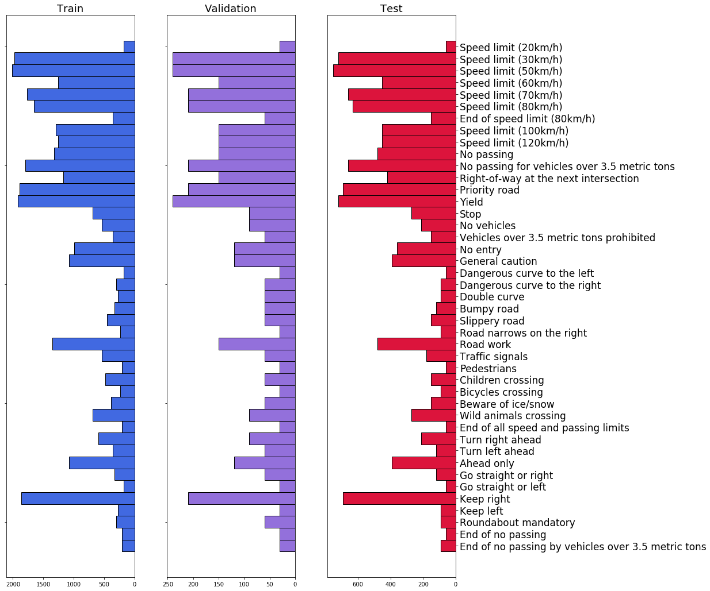


Good! We can see correlation between data sets.


## Design and Test a Model Architecture


### 1. Preprocess the data.

As we saw above, the data set contains images with different brightness and contrast. This can be fixed using [CLAHE](https://en.wikipedia.org/wiki/Adaptive_histogram_equalization#Contrast_Limited_AHE) technique. [OpenCV](http://docs.opencv.org/3.1.0/d5/daf/tutorial_py_histogram_equalization.html) library has a  function `cv2.createCLAHE()` which we'll use. After histogram equalization is implemented we get this:

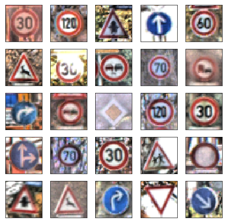

[Taken from stackexchange.com:](https://stats.stackexchange.com/questions/185853/why-do-we-need-to-normalize-the-images-before-we-put-them-into-cnn)

>Subtracting the data set mean serves to "center" the data. Additionally, we divide by the sttdev of that feature to normalize each feature value to a z-score.
Let's consider how a neural network learns its weights. CNNs learn by continually adding gradient error vectors (multiplied by a learning rate) computed from backpropagation to various weight matrices throughout the network as training examples are passed through.
The thing to notice here is the "multiplied by a learning rate".
If we didn't scale our input training vectors, the ranges of our distributions of feature values would likely be different for each feature, and thus the learning rate would cause corrections in each dimension that would differ (proportionally speaking) from one another. We might be over compensating a correction in one weight dimension while undercompensating in another.
This is non-ideal as we might find ourselves in a oscillating (unable to center onto a better maxima in cost(weights) space) state or in a slow moving (traveling too slow to get to a better maxima) state.

Also, CS231n's [great lecture](http://cs231n.github.io/neural-networks-2/#datapre) with section about data preprocessing

```python
# Preprocess data: helper functions
import cv2
import numpy as np

# Improve contrast in images using CLAHE technique
def correct_contrast(dataset):
    clahe = cv2.createCLAHE(clipLimit=10.0, tileGridSize=(4,4))
    data = np.copy(dataset)
    for i in range(len(data)):
        img = data[i] 
        img = cv2.cvtColor(img, cv2.COLOR_RGB2HSV)
        img[:, :, 2] = clahe.apply(img[:, :, 2])
        img = cv2.cvtColor(img, cv2.COLOR_HSV2RGB)
        data[i] = img
    return data

# Zero-center data
def zero_center(dataset):
    data = np.copy(dataset)
    data = data - np.mean(data)
    return data
```

```python
X_train_corr = correct_contrast(X_train)
X_valid_corr = correct_contrast(X_valid)
X_test_corr = correct_contrast(X_test)

X_train_norm = zero_center(X_train_corr)
X_valid_norm = zero_center(X_valid_corr)
X_test_norm = zero_center(X_test_corr)
```

What it looks like after the preprocessing stage:


### 2. What the final model architecture looks like.

---
**Layer 1: Convolutional.** Input 32x32x3. Filter 5x5x64. Output 28x28x64.

* **Batch Normalization**
* **Activation.** ReLU.
* **Pooling.** Filter 2x2. Stride 2. Output 14x14x16.
* **Dropout** 0.65

**Layer 2: Convolutional.** Input 14x14x64. Filter 3x3x128. Output 12x12x128.

* **Batch Normalization**
* **Activation.** ReLU.
* **Pooling.** Filter 2x2. Stride 2. Output 6x6x128.
* **Dropout** 0.50

**Layer 3: Convolutional.** Input 6x6x128. Filter 3x3x256. Output 4x4x256.

* **Batch Normalization**
* **Activation.** ReLU.
* **Pooling.** Filter 2x2. Stride 2. Output 2x2x256.
* **Dropout** 0.50

**Flatten.** Flatten the output shape of the last convolutional layer such that it's 1D instead of 3D. 
Input 2x2x256. Output 1024.

**Layer 4: Fully Connected.** Input 1024. Output 512.

* **Batch Normalization**
* **Activation.** ReLU.
* **Dropout** 0.40

**Layer 5: Fully Connected.** Input 512. Output 512.

* **Batch Normalization**
* **Activation.** ReLU.
* **Dropout** 0.40

**Layer 6: Fully Connected (Logits).** Input 256. Output 43.

**Output:** Return the result of the 3rd fully connected layer.

---

Using [TensorBoard](https://www.tensorflow.org/get_started/summaries_and_tensorboard) we can visualize network's architecture. 

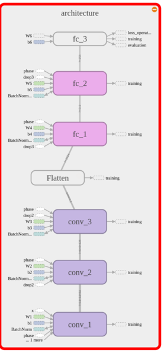

To do this we use [`tf.name_scope("name")`](https://www.tensorflow.org/get_started/graph_viz) while defining the network:

```python
...some code here...
with tf.name_scope("architecture"):
    with tf.name_scope("conv_1"):
        ... define Layer1 ...
    with tf.name_scope("conv_2"):
        ... define Layer2 ...
    with tf.name_scope("conv_3"):
        ... define Layer3 ...
    with tf.name_scope("fc_1"):
        ... define Layer4 ...
    with tf.name_scope("fc_2"):
        ... define Layer5 ...
    with tf.name_scope("fc_3"):
        ... define Layer6 ...
```

After that we save graph like this:

```python
# Save graph for visualization in TensorBoard
with tf.Session() as sess:
    writer = tf.summary.FileWriter("fnet_graph_all")
    writer.add_graph(sess.graph)
```

Later in terminal type `tensorboard --logdir="fnet_graph_all"` and that's it!

*Note: after saving graph I had to delete `tf.name_scope()` part of the code because it caused some troubles while restoring the model and I haven't figured the way to fix this.*

### 3. How the model was trained. 

Model was trained on a local machine with NVIDIA GeForce GTX 750 Ti graphics card on board.

Model was trained using Adam optimizer and learning rate step decay technique as described in 
<a href="http://cs231n.github.io/neural-networks-3/#anneal">CS231n lecture</a>:

> In training deep networks, it is usually helpful to anneal the learning rate over time. Good intuition to have in mind is that with a high learning rate, the system contains too much kinetic energy and the parameter vector bounces around chaotically, unable to settle down into deeper, but narrower parts of the loss function.

Other nice feature that was used in order to avoid "dead neurons" is so called `He initialization`. It is nicely described <a href="https://arxiv.org/pdf/1704.08863.pdf">here</a> why we use it. CS231n lecture as well suggests this method as default:

> **In practice**, the current recommendation is to use ReLU units and use the w = np.random.randn(n) * sqrt(2.0/n), as discussed in [He et al](https://arxiv.org/pdf/1502.01852.pdf).

In Tensorflow it is implemented in `tf.contrib.layers.variance_scaling_initializer()`.

In order to prevent overfitting was used a regularization technique called <a href="http://cs231n.github.io/neural-networks-3/#regularization">Dropout</a>.

---
Training parameters:

- optimizer: Adam
- epochs: 40
- batch size: 128
- initial learning rate: 0.0008
- dropout parameters for different layers: 0.65, 0.5, 0.4
- step decay: 0.5
- decay frequency: every 5 epochs
---


### 4. The approach taken for finding a solution and getting the validation set accuracy to be at least 0.93. 

Final model results were:

* training set accuracy of `100%`
* validation set accuracy of `98.4%` 
* test set accuracy of `98.6%`


**The steps:**

Note: at first, the preprocessing stage included only zero-centering and, in order to increase training speed, batch size of 256 samples.

* The first architecture that was tested on German Traffic Signs was LeNet-5 (introduced in lectures). This model showed good results straight out of the box (without preprocessing): validation/test accuracy - `92.4%/92.2%`. However, in order to get these numbers the model was trained for 100 epochs.

* Next step: let's add a better weight initialization method such as [Xavier initialization](http://andyljones.tumblr.com/post/110998971763/an-explanation-of-xavier-initialization) and some regularization (for example, dropout). Along these improvements we can try add more filters in convolutional layers.
 5 Layers; CONV[5x5x32] -> CONV[5x5x64] -> FC[2304x256] -> FC[256x256] -> FC[256x43].
 After `40` epochs with Adam optimizer, batch size `256`, and learning rate `0.00017` validation/test accuracy rose to `96.9%/95.5%`.
 This is definitely an improvement. However, a gap between validation and test accuracy may indicate some level of overfitting.

* Further upgrade ended with validation/test accuracy of `96.8%/96.5%`.
5 Layers; CONV[5x5x32] -> CONV[3x3x64] -> FC[2304x512] -> FC[512x256] -> FC[256x43]. Improvements:
    * different sizes of filters
    * different probabilities for dropout on different layers
    * learning rate annealing every 5 epochs
    * batch normalization ([explained here](https://gab41.lab41.org/batch-normalization-what-the-hey-d480039a9e3b))

* Nexy model got validation/test accuracy of `97.7%/97.0%`.
 6 Layers; CONV[5x5x64] -> CONV[3x3x128] -> CONV[3x3x256] -> FC[1024x512] -> FC[512x256] -> FC[256x43]. 
 Improvements:
    * added one more layer
    * added more filters
    * Xavier initialization was replaced by He initialization as it is better with ReLUs

* Final model's validation/test accuracy - `98.4%/98.6%`.
6 Layers; CONV[5x5x64] -> CONV[3x3x128] -> CONV[3x3x256] -> FC[1024x512] -> FC[512x256] -> FC[256x43]. 
Improvements:
    * CLAHE preprocessing
    * batch size `128` ([some insight on choosing batch size](https://arxiv.org/pdf/1609.04836.pdf)) 


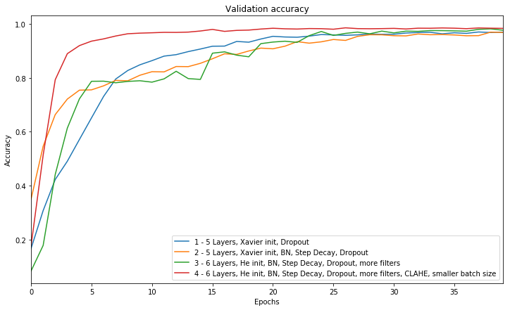


## Test the Model on New Images


### 1. Let's choose ten German traffic signs found on the web and try our model.


Here are ten German traffic signs found on the internet:


These images were prepared for the network. They were manually cropped and resized to 32x32.

By looking at the data distribution ("Exploratory visualization" section above), we can say that signs 'Yield', 'Speed limit (30km/h)', 'Priority road' are likely to be predicted correctly, whereas signs 'Bumpy road', 'Go straight or right', 'Roundabout mandatory', 'Pedestrians' might be predicted wrong. 

We have images of good overall quality, they are not too dark and not too bright. We can clearly see that signs are recognizable. However, 'Stop' sign has some kind of noise (probably a shadow) and that might cause difficalties for our model. Signs 'Pedestrians', 'Speed limit (30km/h)' and 'Roundabout mandatory' were shot at some angle and that also might cause troubles for prediction. 'Bumpy road' sign has barely recognizable bumps pictured and that as well could be a problem.

Now, let's see.


### 2. Model's predictions on new traffic signs.


| Image			                              |     Prediction	        		             | 
|:--------------------------------------|:--------------------------------------| 
| Priority road   		                    | Priority road					                    | 
| Go straight or right                  | Go straight or right				              |
| Bumpy road			                         | Bumpy road					                       |
| Right-of-way at the next intersection | Right-of-way at the next intersection	|
| Yield			                              | Yield        					                    |
| Stop   		                             | Priority road	                        | 
| Road work     			                     | Road work					                        |
| Pedestrians				                       | Turn left ahead			                   	|
| Speed limit (30km/h)	      	          | Speed limit (30km/h)	 			             |
| Roundabout mandatory		                | Roundabout mandatory     			          |


The model was able to correctly guess 8 of the 10 traffic signs, which gives an accuracy of 80%. This compares favorably to the accuracy on the test set of 98.6%. Note, that only one of four the least frequent sings in the training set (thus most likely to be predicted wrong) 'Pedestrians' was predicted wrong.


### 3.  The top 5 softmax probabilities for each image along with the sign type of each probability.

<p align="left">

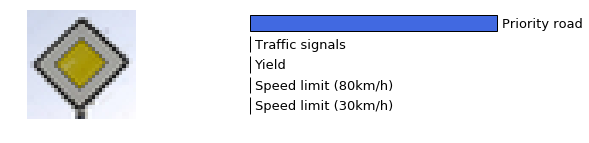

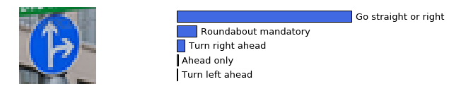

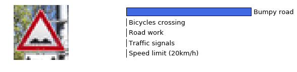

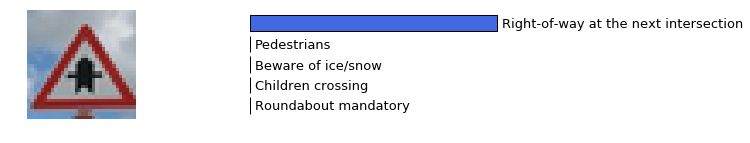


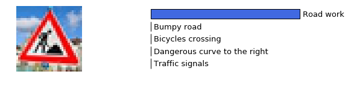


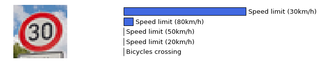


</p>


## Visualizing the Neural Network


### 1. The visual output of our trained network's feature maps.

For an example of what feature map outputs look like, check out NVIDIA's results in their paper End-to-End Deep Learning for Self-Driving Cars in the section [Visualization of internal CNN State](https://devblogs.nvidia.com/parallelforall/deep-learning-self-driving-cars/#attachment_7044). NVIDIA was able to show that their network's inner weights had high activations to road boundary lines by comparing feature maps from an image with a clear path to one without.


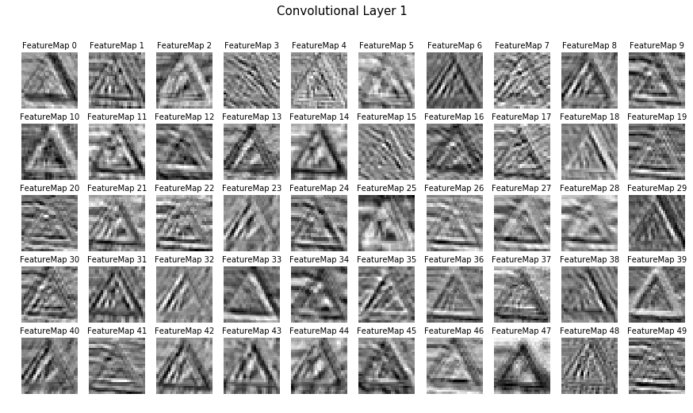


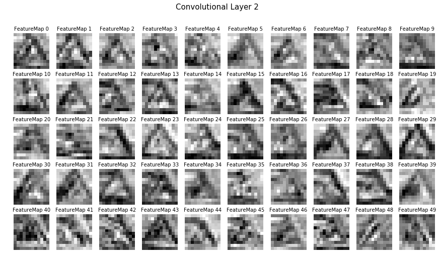

